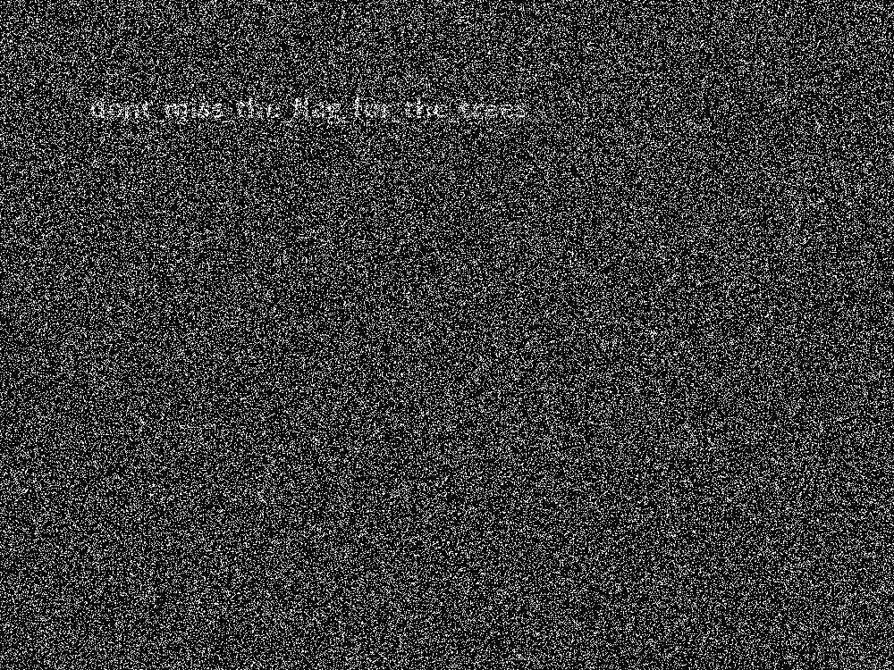

Bitesized - 80 points
===

Writeup by poortho
------
Problem Statement:
There’s an image of some trees here. I bet the image contains more than trees, though. [trees.png](trees,png)

Hint:

Try mod 8?

------

Writeup
------
This problem was fairly simple, all you had to do was run [stegsolve](http://www.caesum.com/handbook/Stegsolve.jar) on it and we get the flag. 

Flag
------

`dont_miss_the_flag_for_the_trees`