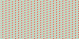

Visual Words - 70 points
===

Writeup by poortho
------
Problem Statement:
Some of us are visual learners. Some of us learn best from texts. I’ve found the perfect [combination](visual.png)! It was a bit dark though, so I had to make it brighter by some factor.



Hint:

Number, words, colors, data. It’s all really just numbers and math right?

------

Writeup
------
Looking at the png, it doesnt seem like there is any hidden data. Stegsolve also will not work. Looking at the pixel data, we see that the entire png is simply a repeat of the same 12 pixels in a row.

Judging from the hint, we are supposed to use some sort of math to decode the flag.

After closely inspecting the pixel values of the 12 pixels, we notice that every one of them is even. Perhaps this is what they mean by making it brighter?

As it turns out, dividing each rgb value of the twelve pixels gives us the flag.

Here is my code:
```python
from PIL import Image

im = Image.open('visual.png')
im2 = im.convert('RGB')

s = ""
for x in range(12):
    for y in range(3):
        s += chr(im2.getpixel((x,0))[y]/2)
print s
```

Flag
------

`flag_HidingSomeFunStuffInThisImage!!`
