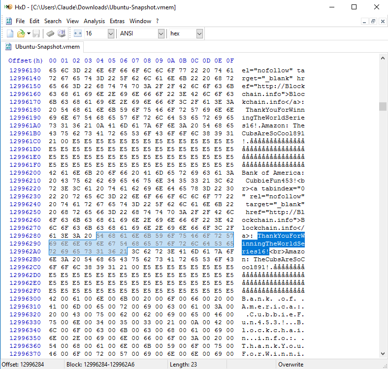

## stability

#### Writeup by poortho
* **Forensics**
* *200 points*
* Hey, my friend just told me he forgot his super important password to one of those crypto money things. Fortunately, he logged onto my computer one time when he was looking at it. Can you help me find his password?
* Files:
  * [Ubuntu-Snapshot.vmem](https://drive.google.com/file/d/0B42xuEQ8CPHjR1NtbnlYMHBKazg/view)
* 3 Solves

# Solution

In the google drive link, we are given a .vmem file to analyze. We have to find some sort of password of a "crypto money thing".

This problem is actually very easy, and way more teams could have solved it.

1. "crypto money thing" almost certainly suggests bitcoin/blockchain
2. .vmem files store raw data, meaning that many files in the VM will still be intact

Given this information, we can open up the .vmem file using a hex editor (I used [HxD](https://mh-nexus.de/en/hxd/)). We can simply ctrl+f "blockchain" and we eventually get the password, which is the flag.

:perm

# Flag

`ThankYouForWinningTheWorldSeries16!`
