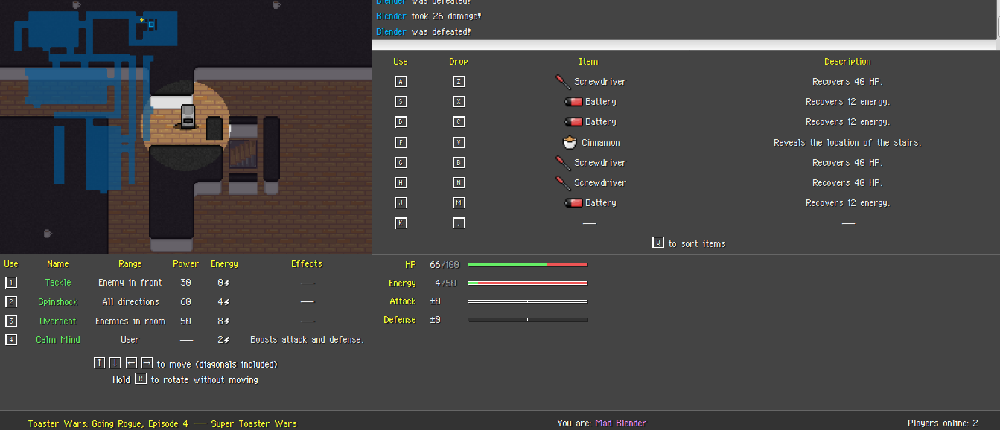

# TW\_GR\_E4\_STW Alternate Solution
#### Writeup by Valar_Dragon

* **Web**
* *200 points*
* Many saw the fourth installment of Toaster Wars: Going Rogue as a return to grace after the relative mediocrity of the third. I'm just glad it was made at all. And hey, they added some nifty new online scoreboard features, too!

In the past few Toaster Wars problems, we've had to go up a few levels to get to the flag room, with the flag being on the last level. Lets try doing the same here.

When we walk up to the 4th floor, we find:


The Stairwell is blocked off! :L

(Normally the walls surrounding the stairwell aren't connected to the main wall, but it was the only screenshot of TW_4 I have, since they took down the game.)

We identified 5 different possible routes for where the vulnerability could lie.


* We somehow can remove/bypass walls
* We somehow can relocate stairs
* We somehow can bypass levels
* We somehow can teleport onto stairs
* We somehow can spawn onto stairs

Long story short, its pretty easy to show that you can't turmeric onto stairs.
We found no way to relocate the staircase.
However, we identified a potential attack vector for bypassing levels, where we use the fact that our level is being read from a database when incrementing the level upon reaching a staircase, instead of being a variable in the state.
This means that if we could pwn the database through the scoreboard somehow, we could increment our level when we are on level 3 to be level 4 in the database.
Then when we hit the level 3 staircase, it'd think we hit the level 4 staircase and take us to level 5 for our flag!
But the database was mongoDB, and we would have to write our own client to get the socketID client side, so we thought we'd leave this as a backup strategy.

Now lets look at the alternate route that we found which did work. First we have to look at the motion code, and see if we can move into a wall.

So just like in the previous challenges, lets navigate to the source files. `http://shell2017.picoctf.com:64062/server/game.js`


```js
function executeMove(state, entity, action, log){
	var direction = action.direction;
	var directionArr = utils.decodeDirection(direction);

	if(directionArr == null){
		return false;
	}

	if(state.map.grid[entity.location.r][entity.location.c] == 0 && direction % 2 == 1){
		return false;
	}

	if(utils.getEntityAtLocation(state, entity.location.r + directionArr[0], entity.location.c + directionArr[1]) != null){
		return false;
	}

	entity.location.r += directionArr[0];
	entity.location.c += directionArr[1];

	if(entity.location.r < 0
	   || entity.location.r >= state.map.height
	   || entity.location.c < 0
	   || entity.location.c >= state.map.width
	   || state.map.grid[entity.location.r][entity.location.c] < 0
	   || (state.map.grid[entity.location.r][entity.location.c] == 0 && direction % 2 == 1)){
	   	entity.location.r -= directionArr[0];
		entity.location.c -= directionArr[1];
		return false;
	}

	var msg = {
		entity: {
			id: entity.id,
			name: entity.name
		},
		action: {
			type: "move",
			direction: direction
		},
		outcome: []
	};

	// item check
	if(entity.items.length < entity.stats.maxItems){
		var itId = -1;
		var name = "";
		for(var i = 0; i < state.items.length; i++){
			if(state.items[i].location.r == entity.location.r && state.items[i].location.c == entity.location.c){
				itId = state.items[i].id;
				msg.outcome.push({
					type: "item/get",
					id: state.items[i].id,
					item: state.items[i].name
				});
				break;
			}
		}
	}

	entity.items = entity.items.concat(state.items.filter(function(it){ return it.id == itId; }));
	state.items = state.items.filter(function(it){ return it.id != itId; });

	log.push(msg);

	return true;
}

```
So when you try to move, it first sees if you are in a hallway (thats what having a grid value of 0 means),
and if you are it prevents you from moving diagonally.
Then it makes sure you are not walking into an entity.
Then it prevents you from walking into a wall.
It checks that your destination isn't a wall, so it doesn't look like we can exploit that.

So next up on our list, we wanted to see if we could force the spawn location to be onto the stairs.
Our spawn location is set in `http://shell2017.picoctf.com:64062/server/generator.js`

The relevant portion is:

```js
  // Place player

		var playerLocation = {r: Math.floor(Math.random()*opts.map.height), c: Math.floor(Math.random()*opts.map.width)};

		while(grid[playerLocation.r][playerLocation.c] <= 0){
			playerLocation = {r: Math.floor(Math.random()*opts.map.height), c: Math.floor(Math.random()*opts.map.width)};
		}

		// Place stairs

		var stairsLocation = {r: Math.floor(Math.random()*opts.map.height), c: Math.floor(Math.random()*opts.map.width)};

		while(grid[stairsLocation.r][stairsLocation.c] <= 0 || (stairsLocation.r == playerLocation.r && stairsLocation.c == playerLocation.c)){
			stairsLocation = {r: Math.floor(Math.random()*opts.map.height), c: Math.floor(Math.random()*opts.map.width)};
		}

		if (opts.unfair) {
			grid[stairsLocation.r - 1][stairsLocation.c - 1] = -1;
			grid[stairsLocation.r - 1][stairsLocation.c] = -1;
			grid[stairsLocation.r - 1][stairsLocation.c + 1] = -1;
			grid[stairsLocation.r][stairsLocation.c - 1] = -1;
			grid[stairsLocation.r][stairsLocation.c + 1] = -1;
			grid[stairsLocation.r + 1][stairsLocation.c - 1] = -1;
			grid[stairsLocation.r + 1][stairsLocation.c] = -1;
			grid[stairsLocation.r + 1][stairsLocation.c + 1] = -1;
		}

```
So the first part says, we are gonna place the player somewhere on the map thats not a wall or hallway.
The second part says, we are going to place the staircase somewhere on the map thats not a wall or hallway or where the player is.

The third part, `opts.unfair`, is what is set on level 4 only.
It is placing a wall at all 8 locations around the staircase.
But wait, a player could technically spawn in one of those locations!
If you do the first few levels by hand enough times, you may have already actually spawned one tile away from the stairs!

So if we went to level 4 enough times, we would eventually spawn in a wall surrounding the staircase! And from the movement code, it does not check if you are coming from a wall, it only checks if your destination is a wall. The code for hallways also only checks if you are coming from `grid[x][y]=0`, not if your coming from `gridvalue[x][y] <= 0`!

So this means if you spawned in any of the 8 tiles around the staircase, you could just walk right into the staircase, and go get the flag! At this point we were slightly worried about having to make a bot, which would then navigate to level 4 enough times to finally spawn into the staircase. (We estimated that there were ~1000 tiles in rooms on level 4, so that would mean we would expect the bot to run $$ \frac{1000}{8} = 125 $$ times )

This was going to both be a lot of work, and a lot of load on their servers, so we asked the admins if this was intended.
bluepichu, the challenge creator told us that it would work, but it was an unintended solution!
He hadn't realized you could do that! (It was also wayyy harder than the intended solution)
We got the greenlight to do it as long as we only used a few bots in parallel, but we didn't really want to spend like 10 hours writing a toaster wars bot, so we found the intended solution soon after.

So I count this challenge as a double win! We solved it the regular way, see intelagent's writeup, and we found a second way to solve it!

It has been leaked that a more full version of toaster wars may come out, so we can relive the memories of Pokemon Mystery Dungeon Blue more fully :D
